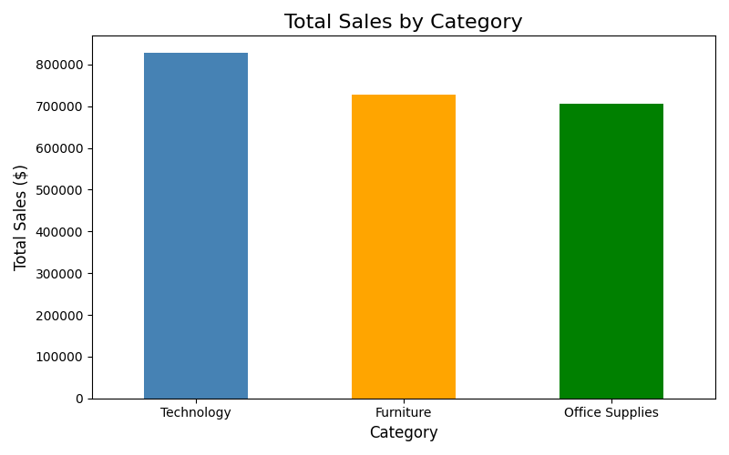
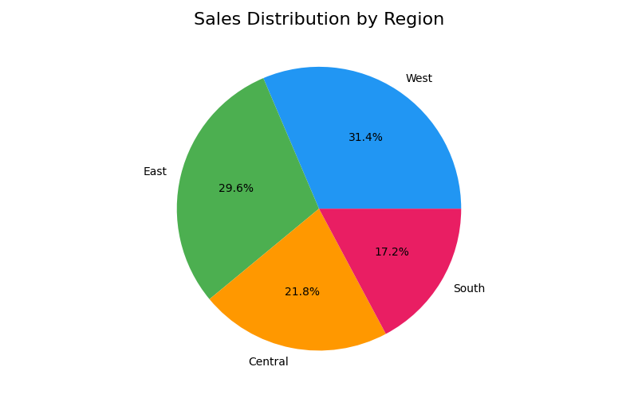
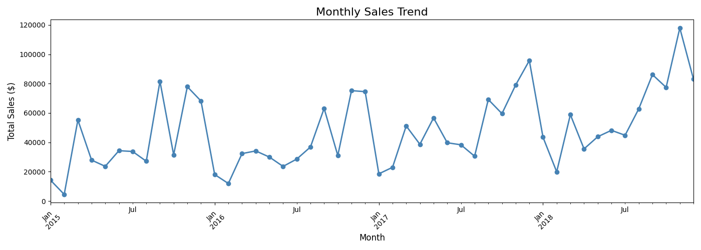
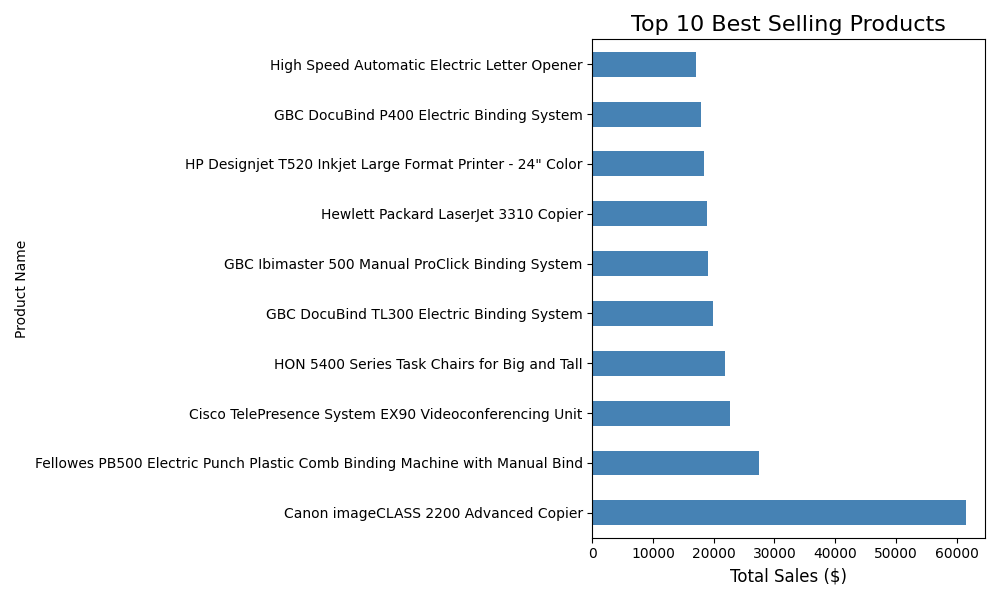

# 🛒 Superstore Sales Analysis

## 📌 Project Overview
This project analyzes retail sales data from a superstore 
to discover business insights about sales performance, 
profit trends, and customer behavior.

## 🛠️ Tools Used
- Python
- Pandas (data analysis)
- Matplotlib & Seaborn (data visualization)
- Google Colab (browser-based coding)

## 📊 Key Findings
- Technology category generated the highest sales
- West region was the most profitable region
- Furniture category had the lowest profit margin
- Sales peak observed during November and December

## 📈 Charts & Visualizations
### Sales by Category

### Sales by Region

### Monthly Sales Trend

### Top 10 Products

## 📁 Dataset
Source: Kaggle — Superstore Sales Dataset

## 👤 Author
Hemanshi Gajra
Aspiring Data Analyst
